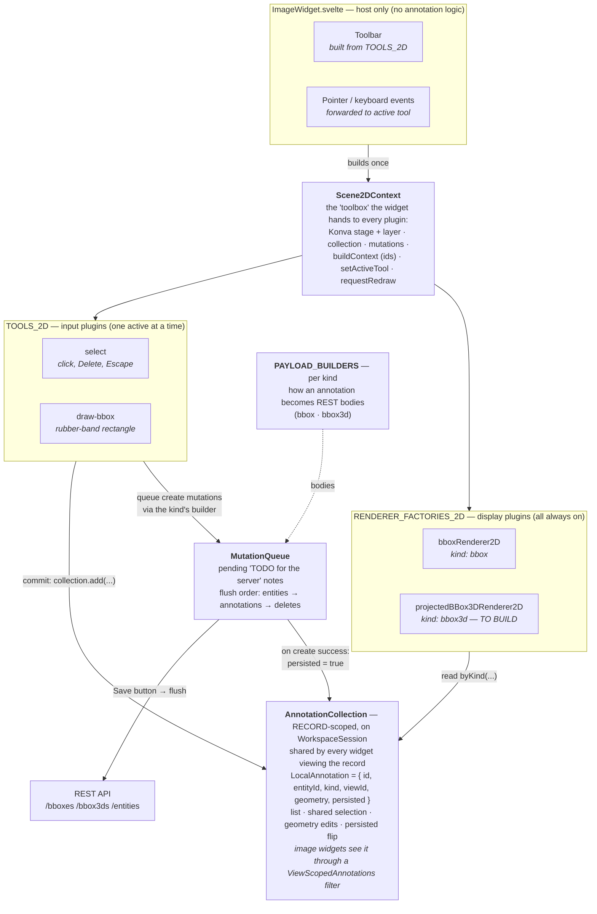

# Annotation tooling — how the pieces fit (`ui/apps/web`)

> Companion to [ARCHITECTURE_TOOLING.md](./ARCHITECTURE_TOOLING.md). Written for anyone adding
> an annotation feature — the worked example at the end is **projecting 3D
> boxes onto the image widget**.

## The big picture

One sentence: **widgets are dumb hosts; everything annotation-specific is a
small plugin that signs up in a list.**

The same shape exists for 3D (`TOOLS_3D`, `kinds/3d/bbox3d/boxEditor`), with
one difference: the single 3D kind's pointer handling lives in its editor
service inside the Threlte scene, because that's where the camera lives.

## The journey of one click (draw a 2D box)

1. User clicks the ▢ button → `storage.activeToolId = "draw-bbox"` → the
   widget swaps in that tool's handler.
2. Drag = handler draws a preview rectangle on the Konva layer.
3. Release = handler calls `collection.add({ kind: "bbox", geometry, persisted: false })`
   and queues two mutations from `bboxPayloadBuilder.buildCreate` (the parent
   entity + the bbox).
4. The collection changed → the widget asks every renderer to `sync()` → the
   rectangle appears, drawn dashed (draft style).
5. Save → `MutationQueue.flush()` sends entities before annotations; on
   success the annotation flips `persisted: true` → drawn solid.

## Where everything lives

| Concept | File |
|---|---|
| Data model + collection | `lib/annotations/annotationCollection.svelte.ts` |
| Tool/renderer interfaces, `Scene2DContext` | `lib/annotations/tools/types2d.ts` |
| Registries (2D tools + renderers) | `lib/annotations/tools/registry2d.ts` |
| Payload-builder registry, generic delete | `lib/annotations/payloadBuilders.ts` |
| Seed-loader registry (REST→local, once per record) | `lib/annotations/seedLoaders.ts` |
| One folder per kind | `lib/annotations/kinds/2d/bbox/`, `3d/bbox3d/` |
| Shared 2D pixel↔normalized helpers | `lib/annotations/tools/scene2dGeometry.ts` |
| 3D Lance↔Three.js transforms | `lib/annotations/coordinateTransforms.ts` |

Full recipe: ARCHITECTURE_TOOLING.md → "Adding a new annotation kind".

## Worked example: projecting 3D boxes onto the image widget

The key idea the architecture was designed around: **a renderer is "kind ×
scene", not just "kind"**. A `bbox3d` annotation can have *two* renderers —
gizmos in the 3D scene (exists) and a projected wireframe in the 2D scene
(to build). You add a display for an existing kind **without touching any
tool, widget, or the queue** — and because the collection is record-scoped
and shared, the bbox3ds are *already visible* to the image widget
(`ViewScopedAnnotations` passes record-scoped kinds through every view
filter). Moving a box in the 3D scene updates the same annotation object the
projection renderer reads, so the projection follows live.

There is very little projection code to write: the math already exists in the
backend (`src/pixano/schemas/annotations/bbox.py`, from PR #645) — port
`get_3dbbox_corners` (unit cube × size × rotation + center),
`project_points` (extrinsics → perspective divide → intrinsics) and the
visibility checks from `get_bbox2d_coords`. About 60 lines, no numpy needed
for 8 points. The backend ignores `distortion`; the port should too (parity
first).

What to build:

1. **The renderer** — `lib/annotations/kinds/3d/bbox3d/projectedBBox3DRenderer2D.ts`,
   implementing `AnnotationRenderer2D` with `kind: "bbox3d"`. Its `sync()`:
   - reads `ctx.collection.byKind<BBox3DGeometry>("bbox3d")` (already
     populated — see above),
   - projects each box's 8 corners through the camera calibration
     (`CameraCalibration` in `lib/annotations/types.ts`) using the ported math,
   - converts to canvas pixels with `getPixelFrame` from `scene2dGeometry.ts`
     and draws Konva lines.
2. **Register it** — one line in `RENDERER_FACTORIES_2D`
   (`lib/annotations/tools/registry2d.ts`).
3. **One small seam to extend**: `Scene2DContext` has no `calibration` field
   yet — add one in `types2d.ts` and populate it in `ImageWidget.svelte` from
   `options.calibration` (already plumbed by `ImageExtension`).
4. **Tests** — renderer `sync()` against a fake `Scene2DContext` (pattern:
   `tools/__tests__/selectTool2D.test.ts`), plus pure projection-math tests
   (pattern: `__tests__/coordinateTransforms.test.ts`).

What you do **not** need to touch: `ImageWidget`'s template or events, the
tool registry, `MutationQueue`, payload builders (projection is read-only
display — no new payloads), or any seeding code.
